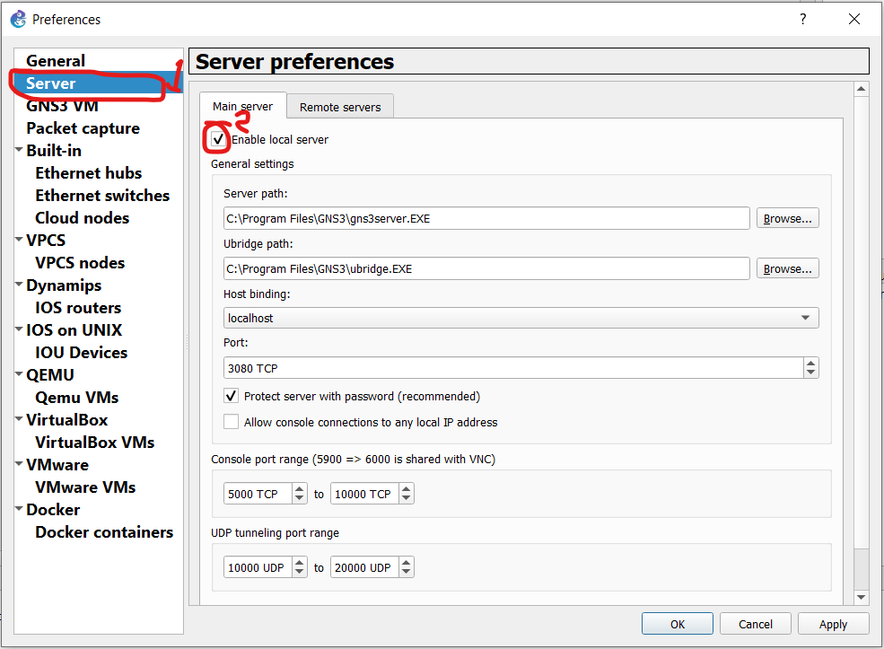
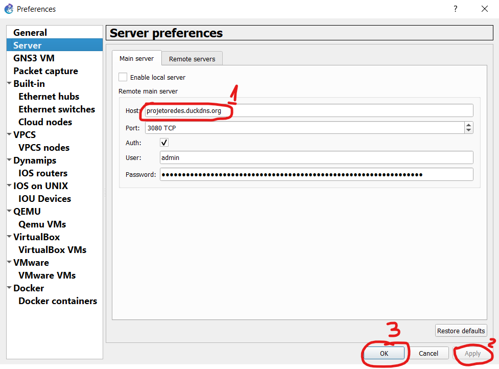
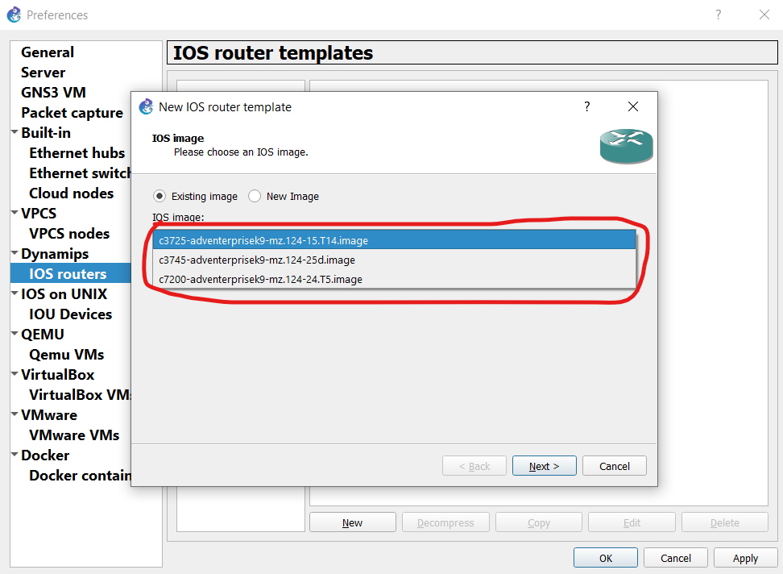
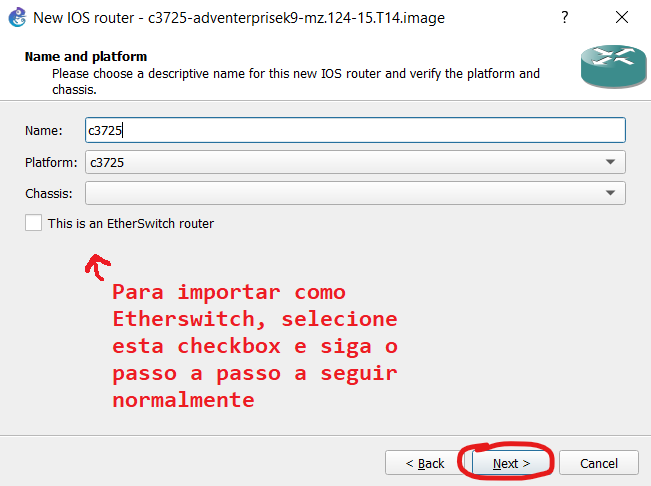

> É pré requisito para este passo a passo ter concluído todas as etapas da [instalação do servidor gns3 na google cloud](../gce-gns3server/gce-gns3server.md)

## Baixando o GNS3 GUI

A interface será utilizada para acessar o servidor da nuvem. Para baixar basta acessar [este link](https://github.com/GNS3/gns3-gui/releases/download/v2.2.3/GNS3-2.2.3-all-in-one.exe). É importante que a versão da GUI seja a mesma do Servidor, caso contrário não funcionará. Baixe, execute e siga os passos de instalação do arquivo deixando todas as checkboxes no padrão..

## Configurando Interface

Abra o GNS3. De vez em quando ele indica novas versões da interface e dá a sugestão da atualizá-la. Não faça isso, pois ela ficará numa versão diferente do servidor.

1. Clique em Edit

2. Clique em Preferences

3. Clique em Server e desabilite a checkbox "Enable Locla Server"

4. No campo host, digite seu domínio do duckdns.

5. Se no servidor da interface aparecer o nome da VM, então a configuração está correta


## Instalando Imagens da CISCO no Dynamips

1. Abra sua VM no terminal
2. Execute os comandos abaixo
```
mkdir /home/gns3/GNS3/images/IOS
cd /home/gns3/GNS3/images/IOS
```
3. Baixando as imagens da cisco
```
wget http://tfr.org/cisco-ios/7200/c7200-adventerprisek9-mz.124-24.T5.bin

wget http://tfr.org/cisco-ios/37xx/3745/c3745-adventerprisek9-mz.124-25d.bin

wget http://tfr.org/cisco-ios/37xx/3725/c3725-adventerprisek9-mz.124-15.T14.bin
```
4. Descompactando as imagens e deletando os arquivos compactados
```
unzip -p c7200-adventerprisek9-mz.124-24.T5.bin > c7200-adventerprisek9-mz.124-24.T5.image

unzip -p c3745-adventerprisek9-mz.124-25d.bin > c3745-adventerprisek9-mz.124-25d.image

unzip -p c3725-adventerprisek9-mz.124-15.T14.bin > c3725-adventerprisek9-mz.124-15.T14.image

rm *.bin
```

## Importando Switchs e Etherswitchs

1. Dentro do GNS3, clique em **Edit > Preferences > Dynamips > IOS routers**
2. Cliquei em New
3. Neste dropdown aparecerá as imagens baixadas anteriormente, escolha a que deseja importar e clique em next

4. Digite o nome da sua instância ou deixe em branco (nome default)

5. Clique em Next
6. Nesta tela você poderá escolher as interfaces de rede da instância. Escolha da forma que mais lhe agradar e clique em Next.

7. Clique em Next
8. Clique em Finish

## Instalando containers docker para instâncias linux

1. Dentro do GNS3, clique em **Edit > Preferences > Docker > Docker containers**
2. Clique em New
3. Selecione New Image e digite o nome da imagem
    > Para buscar imagens acesse a [conta do gns3 no docker hub](https://hub.docker.com/search?q=gns3&type=image) ou o [appliances do marketplace do gns3](https://gns3.com/marketplace/appliances)
    > - "alpine" : Imagem do alpine linux, versão muito leve usada para simular computadores de usuários de redes locais;
    > - "gns3/python-go-perl-php" : Imagem com algumas linguagens de programação instaladas;
    > - "adosztal/dns" : Imagem com **dnsmasq**, ferramenta para configuração de servidores dns;
    > - "gns3/kalilinux" : Imagem com kali linux com **iptables** e **ssh** já instalados ;

4. Clique Next e Finish para o resto das configurações
5. Clique em **File > New Blank Project**
6. Digite o nome do projeto
7. Clique em OK para criar o projeto
8. Arraste a instância do docker instalado anteriormente no seu projeto, para que os dados do container sejam baixados. Após o download, ela estará pronta para ser utilizada.
